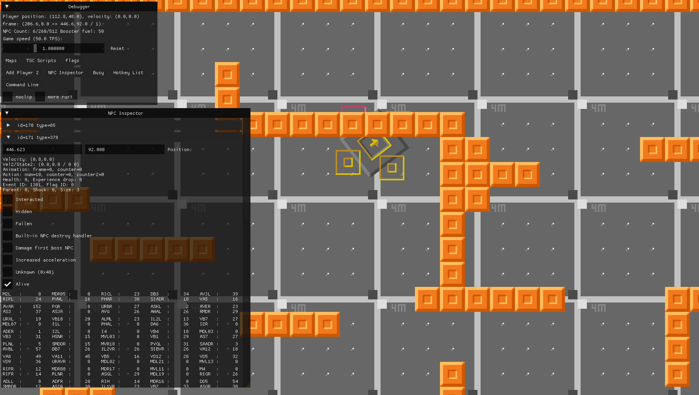

# Connectome Test
Source: [https://github.com/DrGlaucous/CaveS-Public/tree/main/Connectome](https://github.com/DrGlaucous/CaveS-Public/tree/main/Connectome)

This "mod" of Cave Story is really more of a personal experiment than something meant to be played. (Unless you just let it run in the background as a type of screensaver-esque thing)

I wanted to try and get an instance of the C. Elegans connectome up and running in a virtual environment. Cave Story happened to be the environment I was already most familiar with, so I went with that.

The library itself is written in Rust, can can be found in the `3rdparty` folder with the source code.

## How to use (the demo)
This "mod" of Cave Story has only one level and no saves, so opening the application and creating a "new" game will put you in the map with the test article.

To start the simulation, interact with the terminal in the top left of the game map. The camera will focus on the "Connectome" NPC, but because none of the neurons have weights yet, it will be inactive. You can "Jumpstart" it by holding `UP`. This stimulates the neurons associated with food, and it should start running. Once it goes, you shouldn't need to touch it again (unless you want to "Feed" it).

To see what each neuron is doing behind the scenes, hit `F12` to open the debugger menu and select the "NPC Inspector". The NPC with the type ID of 378 is the one the connectome is tied to in the demo (should be pretty easy to see; the other NPCs in the list don't have the massive neuron table)

For more information about how I went about this, see my other repo:
[https://github.com/DrGlaucous/MrConnectome](https://github.com/DrGlaucous/MrConnectome)

### Credits

- Pixel: The original Cave Story game
- Alula: d-rs engine
- Timothy Busbice: [original connectome researcher](http://www.connectomeengine.com/)
- Dr_Glaucous *(that's me!)*: everything that's left over