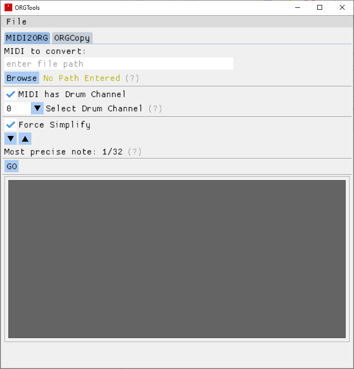

# Quotar hero API


## Overview
Quotar hero is a basic clone of Guitar Hero re-implemented in Cave Story.
[The source code can be found here](https://github.com/DrGlaucous/CaveS-Public/tree/main/ORGExperiment). Since all my projects share a single repo right now, you can use [This website](https://download-directory.github.io/) to grab just the ORGExperiment sub-folder.

The game is designed to be as modular and expandable as possible without needing to recompile the source engine. New levels, band members, and lighting can be implemented completely from a map editor like Booster’s Lab, TKT, or SDE.


In true Cave Story fashion, the game uses ORG files to control events and the note highways.

Channels 1-4 control player 1 notes (5-8 are set aside for player 2, which will be implemented at a later date), and all drum tracks control game events.

For note highways, note pitch doesn’t matter. Any pitch will work, so long as it is in the intended channel.

1. Red (left)
2. Orange (mid-left)
3. Green (mid-right)
4. Blue (right)


Game events are read from the drum track. All drum tracks, QWERTYUI are valid, but since events can only be executed one-at-a-time, typically only a single drum track is needed. Each note has a corresponding pitch “value”. This value is the number of the event ingame to be run. The range is from 20-95.


## TSC Table
The mod adds 20 new commands to the game to control level behavior:


| Command | Name                 | Arg Count | Desc.                                                                                                                                                                                | Example                                                                              |
| ------- | -------------------- | --------- | ------------------------------------------------------------------------------------------------------------------------------------------------------------------------------------ | ------------------------------------------------------------------------------------ |
| CMF     | Cue Music File       | 1         | Load music from a file relative to the data directory                                                                                                                                | <CMF[org/ogg/multi_ogg]:[Filepath from 'data']$                                      |
| CTF     | Cue Tracker File     | 0         | Load tracker from a file relative to the data directory                                                                                                                              | <CTF[Filepath from 'data']$                                                          |
| PSM     | Pause Sound Manager  | 0         | Halts all sound in the same manner as loosing focus                                                                                                                                  | <PSM                                                                                 |
| RSM     | Resume Sound Manager | 0         | Resume all sound in the same manner as gaining focus                                                                                                                                 | <RSM                                                                                 |
| SNH     | Show Note Highway    | 0         | Show the guitar note highway and HUD                                                                                                                                                 | <SNH                                                                                 |
| HNH     | Hide Note Highway    | 0         | Hide the guitar note highway and HUD                                                                                                                                                 | <HNH                                                                                 |
| STS     | Store Tracker Stats  | 1         | Stores guitar stats from the current game and saves all scores to the game’s JSON datafile                                                                                           | <STS[Map No]                                                                         |
| LTS     | Load Tracker Stats   | 0         | Loads each map’s score from the JSON file                                                                                                                                            | <LTS                                                                                 |
| RTS     | Reset Tracker Stats  | 0         | Resets the guitar score of the current game (does not affect saved scores)                                                                                                           | <RTS                                                                                 |
| SSD     | Set Start Delay      | 3         | Synchronizes the song and tracker together when starting (in ms)                                                                                                                     | <SSD[song delay]:[tracker delay]:[extra delay]                                       |
| SCS     | Show sCore Summary   | 2         | Show/Hide the game’s score summary                                                                                                                                                   | <SCS[0000/1]:[Map No]                                                                |
| HSJ     | High Score Jump      | 2         | Jump if the current high score is in any way better than the previous map’s (not just points, but also total, streak, or percentage apply)                                           | <UNP[NPC]:[Act No]:[Gen Var A]:[Gen Var B]                                           |
| UNP     | Ultra aNP            | 4         | Like ANP, but passes back different variables                                                                                                                                        | <UNP[NPC No]:[Act No]:[Gen Var A]:[Gen Var B]                                        |
| UNA     | Ulta aNp All         | 4         | Like UNP but for all NPCs of a type                                                                                                                                                  | <UNA[NPC Type]:[Act No]:[Gen Var A]:[Gen Var B]                                      |
| TNP     | Tick NPc             | 1         | Run this NPC’s backend code immediately, useful for passing back multiple parameters with UNP                                                                                        | <TNP[NPC no]                                                                         |
| FNC     | FuNCtion             | 1         | Run this event, returning to the current event on <END                                                                                                                               | <FNC[Event no]                                                                       |
| CRX     | set CoRner X         | 4         | Set X location of one of the note highway corners. First argument is shared between what corner to select and what anchor (left, center, right) to position it relative to.          | <CRX[00/01/02/03:TL,TR,BL,BR | Anchor 00/01/02:L/C/R]:[Time]:[sign 0/1 +/-]:[Offset] |
| CRY     | set CoRner Y         | 4         | Set Y location of one of the note highway corners                                                                                                                                    | <CRY[00/01/02/03:TL,TR,BL,BR | Anchor 00/01/02:L/C/R]:[Time]:[sign 0/1 +/-]:[Offset] |
| UKY     | Ultra KeY lock       | 0         | Lock the player until <FRE is called, not <END                                                                                                                                       | <UKY                                                                                 |
| TTL     | TiTLe                | 0         | Return directly to the game title, skipping the intro   


---

## NPCs
The mod introduces new NPCs to create a background stage “experience” while the song is playing. These NPCs include:
-   **Gobo (also includes gobo sub-section)**

    This, also known as a “Crowd Blinder” is a light that can pivot back and forth between various angles at various speeds and colors, all specified by <UNP parameters fed into the NPC.
    In order to prevent the gobo from messing things up when setting up values (which often take multiple <UNP and <TNP events for one final state), the gobo will not move unless it’s action number (first arg in <ANP or <UNP) must be set to 0100.

-   **Stage Light**

    Similar to the Gobo, but is a stationary light instead. All lighting effects apply, but it cannot pivot.

-   **Strobe Light**

    Similar to the Strobe Light, but emits a point light instead of a light cone.

-   **Crowd Manager**

    Spawns a horizontal row of “Crowd Member” NPCs between two solid tiles. The NPC’s layer and skin are randomized to make the crowd a homogenous mixture.

-   **Crowd Member**
   
    Stands in place and hops, timed with RNG. Will look forward, up (not implemented yet), and blink when not jumping.

-   **Band Member**

    A modular NPC that has 8 frames of animation stacked vertically. It also indexes another 8 below that if alt direction is used. The speed and skin of the NPC can be set with <UNP values. To add more skins, just expand right, keeping sprite spacing.

Specifics on how these NPCs act can be found in [rave.rs](https://github.com/DrGlaucous/CaveS-Public/blob/main/ORGExperiment/doukutsu-rs-master/src/game/npc/ai/rave.rs) inside the game’s source code. Each event is outlined with comments, so you don’t need to know rust in order to see how each event works.

All of the lights share ANP syntax where parameters are the same.


## Unit Circles:
rust raycast unit circle (used to set and alter light cones):
```
        90
        |
        |
<--0---[ ]---180-->
        |
        |
       270
```


rust sprite rotation unit circle (used to rotate the sprite around its anchor):
```
       3PI/2
         |
         |
<--PI---[ ]---0-->
         |
         |
        PI/2
```


## Tips:

-	To make writing timed events easier, break down each event’s attribute into sub-events and use functions to mix and match events in order to create a full effect. This way, those sub-events can be re-used to create different effects.
-	Already, the several songs already included with the mod make good templates for making new ones. Editor source files were intentionally left in the data folder so comments on the events could be read and understood.
-	Most of the code, save for the events up at the top and the start/end events, is the exact same between maps.


## Creating Event Trackers:

If tracker files are being created for ORG music, setting tempo and timing are pretty straightforward; just copy the parameters from the original file. If OGG music is used, creating the tracker is a bit more difficult.

When I did it, I used an online tempo tapper like [taptempo.io](https://taptempo.io/) to see how fast the source song was.

If I was lucky, the song would divide evenly into an ORG tempo. If not, I used Audacity to slightly stretch or compress the song in order to make it comply. (open the program, drag the song in, select it, and go to Effect>Change Tempo to stretch the song without changing pitch)


Tempo divisibility depends on the resolution set when converting the MIDI to ORG as explained below. This means that a tempo that works for a ‘new’ org will not always work with a populated track. The process of song stretching may need to be revisited after the tracker is made if the two become desynced as the song progresses (even if they were recorded in-sync with the MIDI).


Once the song was properly adjusted, I used a MIDI keyboard and a MIDI recorder application (MidiEditor [http://www.midieditor.org/] in my case) to hammer out a file in realtime while listening to the music. When doing this though, be sure to set the tempo of the record MIDI before recording so it will be converted properly!


After the midi is recorded, I used my tool, OrgTools https://github.com/DrGlaucous/ORGTools to convert the midi into an ORG that would work with the game.
The GUI is pretty self-explanatory, but when selecting the settings, force-simplify to 1/32 and tell the program that the drum track is 0. That way the program will automatically place each separate note pitch into a separate channel for you.




Once that is done, you can move the track notes around and clean up any mistakes you made when recording the initial MIDI.

## Getting timing right:
(This applies to all song types, ORG or OGG)
To make sure both songs are synchronized, find the time in milliseconds it takes to play the first note in the song in milliseconds. With OGG files, Audacity can be used by placing the cursor over the first note hit. To find this value in the ORG file, multiply the number of grid spaces by the ‘wait’ value.
Then in the setup event, run <SSD with those times and it will make sure you press that note as soon as you hear it.


