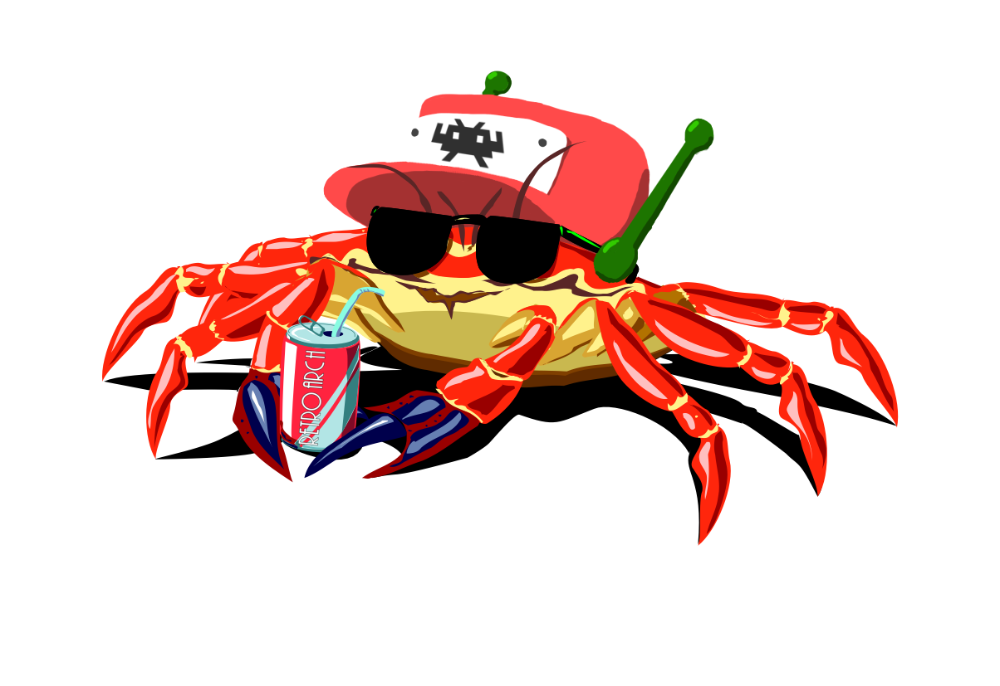

# d-rs-libretro

This is the libretro buildbot-ready version of [doukutsu-rs-nm (retroarch branch)](https://github.com/DrGlaucous/doukutsu-rs-nm/tree/retroarch-dev) *(which is itself is a fork of [doukustu-rs](https://github.com/doukutsu-rs/doukutsu-rs))*. It splits the retroarch interface away from the doukutsu-rs backend so it can be kept up to date more easily. This is basically just a standalone copy of the `drsretroarch` folder in the main repo.

That said, here's the rest of the readme from that branch:

---

This branch adds the ability to build d-rs into a retroarch core. This way, d-rs can take advantage of all the features that Retroarch provides like a common controller API and custom shaders.

This branch is an updated version of the work I did in my dedicated [d-rs retroarch repo](https://github.com/DrGlaucous/drs-retroarch). Putting it here makes it easier to keep up to date with upstream changes, but if you want to see the project's deep git history, look at the other repo.

### Feature Checklist
- [x] Screen drawing (openGL)
- [X] Screen drawing (openGLES)
- [ ] Screen drawing (software?)
- [x] Screen rescaling *(see core display settings)*
- [x] Game timing
- [x] Audio (asynchronous)
- [ ] Audio (synchronous?)
- [ ] V-Sync support
- [x] Core restarting
- [ ] Input (Keyboard) *(implemented, but disabled because the keyboard can be mapped to the virualPad)*
- [ ] Input (touch) *(carryover from the android port where certain items like menus can be interacted with)*
- [x] Input (Gamepad)
- [x] Core display settings (aspect ratio, scale, etc.)
- [x] Filesystem
- [X] Platforms
  - [x] Windows
  - [X] Linux
  - [X] Mac OS *(at least openGL 3 required)*
  - [x] Android
  - [X] iOS
  - [X] tvOS *(Apple TV 4 or newer)*

### Use
It its current state, d-rs runs on 5/5 "big" platforms. ~~*(mac OS was tried, but the compatibility context for hardware rendering was broken. Shaders for the backend would not compile, and if the openGL context were set to a version where they'd work, the **frontend's** shaders would break. This doesn't matter too much since d-rs already has a native mac port)*~~

*Note: the mac OS port now works, but requires at least openGL 3.3 to run. Older versions are not supported by the newest Retroarchs for Mac.*

Since this port isn't currently part of libretro's upstream build system, some extra steps need to be taken in order to use it with Retroarch. 

Before loading in the core, the `doukutsu-rs-libretro.info` file must be placed with the other info files in Retroarch's documents directory. This is because even though the core will work just fine without it, the Retroarch UI requires the info file to understand how to load files to the core. Without it, the frontend will refuse to start the game.

To use the UI with the Nintendo switch port of Cave Story, you need to put a dummy target in next to the `data` directory. This is because the UI requires *some* file to "load in", regardless if the core actually uses it or not. An empty text file named `Target.exe` will work just fine for this purpose (the only important part is the `.exe` extension).

If the command line is used to load in the core instead, both of these prerequisites can be ignored.

### Building

Simply run the `cargo build` command from within the drsretroarch subdirectory to build the core for the parent system. To build it for other systems, the process is no different than building a generic library. (For instance, for android, you'd use [cargo ndk](https://github.com/bbqsrc/cargo-ndk), or for iOS, [cargo lipo](https://github.com/TimNN/cargo-lipo).)

Optionally, there's a makefile in the `drsretroarch` subdirectory that automates things like codesigning for the IOS libraries and renaming for the linux and android libraries. (It automatically downloads the proper targets for compilation and trims the `lib` prefix from the built libraries to match the retorarch naming semantics.)
Using `make` will build the retroarch library for the current system. `make ios` will build for IOS (requires `cargo lipo`), `make android` will build for android (requires `cargo ndk`).

